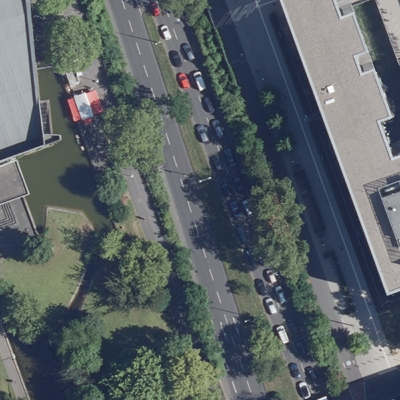
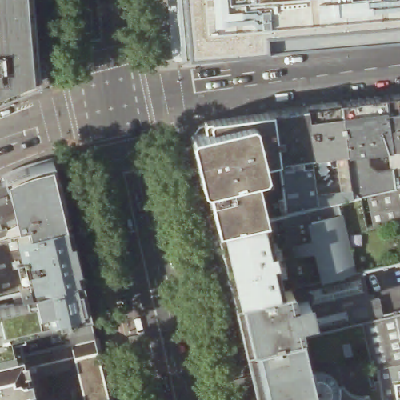
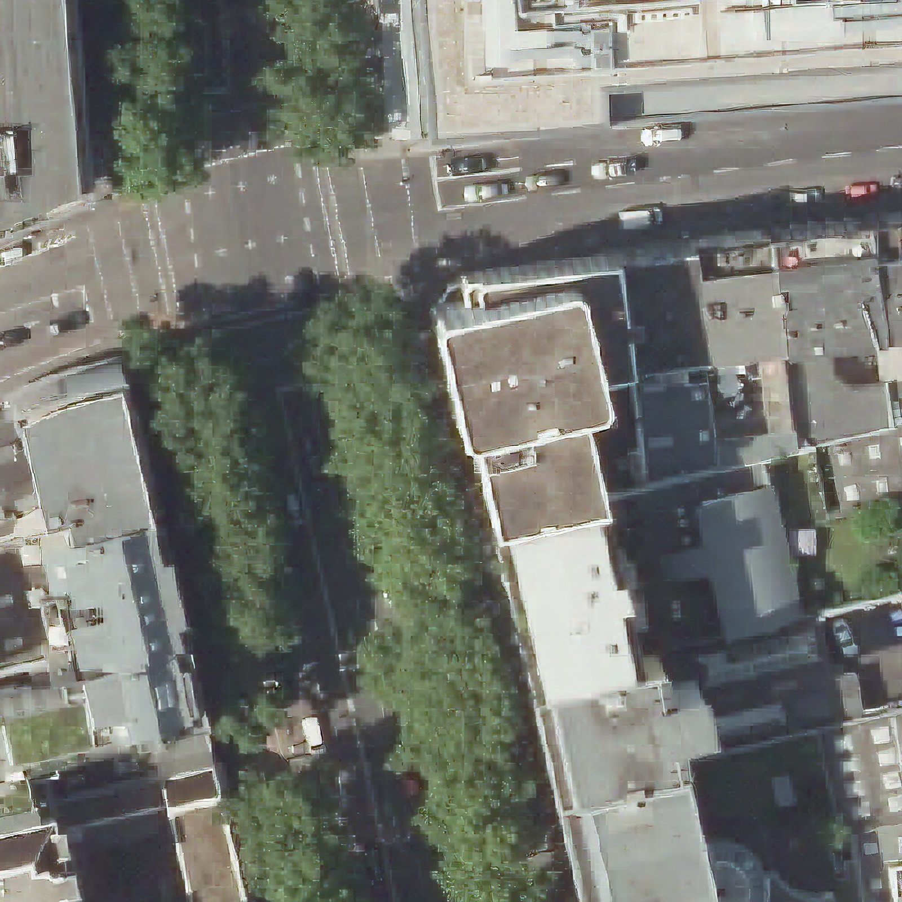
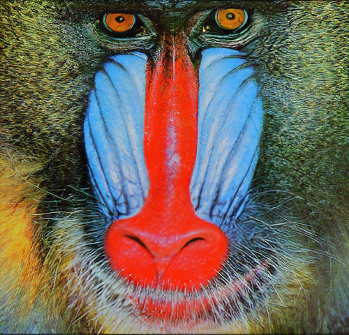

# Streamlit based ISR using ESRGAN [](https://www.repostatus.org/#active) [](https://prateekralhan.github.io/)
A simple streamlit based webapp demonstrating Image Super Resolution using [ESRGAN.](https://github.com/xinntao/ESRGAN)


## Installation:
* Simply run the command ***pip install -r requirements.txt*** to install the dependencies.

## Usage:
1. Clone this repository and install the dependencies as mentioned above.
2. Make a directory within this cloned repository with the name `.streamlit` *(Don't forget the dot !!)*.
3. Create a file `config.toml` in this directory *(Be aware of the file extension !!)*.
4. Copy-Paste the following contents in this file and save :
```
[theme]
primaryColor="#b11b1b"
backgroundColor="#080e1c"
secondaryBackgroundColor="#203659"
textColor="#bf7c7c"
```
5. Navigate to the root directory and create another directory with the name `models`.
6. Download pretrained models from [here](https://drive.google.com/drive/u/0/folders/17VYV_SoZZesU6mbxz2dMAIccSSlqLecY), and place them inside this directory.
7. Navigate to the root directory of this repository and simply run the command: 
```
streamlit run app.py
```
Navigate to http://localhost:8501 in your web-browser.


8. By default, streamlit allows us to upload files of **max. 200MB**. If you want to have more size for uploading files, execute the command :
```
streamlit run app.py --server.maxUploadSize=1028
```


## Results 

  
 
 
  


### Running the Dockerized App
1. Ensure you have Docker Installed and Setup in your OS (Windows/Mac/Linux). For detailed Instructions, please refer [this.](https://docs.docker.com/engine/install/)
2. Navigate to the folder where you have cloned this repository ( where the ***Dockerfile*** is present ).
3. Build the Docker Image (don't forget the dot!! :smile: ): 
```
docker build -f Dockerfile -t app:latest .
```
4. Run the docker:
```
docker run -p 8501:8501 app:latest
```

This will launch the dockerized app. Navigate to ***http://localhost:8501/*** in your browser to have a look at your application. You can check the status of your all available running dockers by:
```
docker ps
```


## References:
```
https://github.com/xinntao/ESRGAN
```

```
@InProceedings{wang2018esrgan,
    author = {Wang, Xintao and Yu, Ke and Wu, Shixiang and Gu, Jinjin and Liu, Yihao and Dong, Chao and Qiao, Yu and Loy, Chen Change},
    title = {ESRGAN: Enhanced super-resolution generative adversarial networks},
    booktitle = {The European Conference on Computer Vision Workshops (ECCVW)},
    month = {September},
    year = {2018}
}
```
